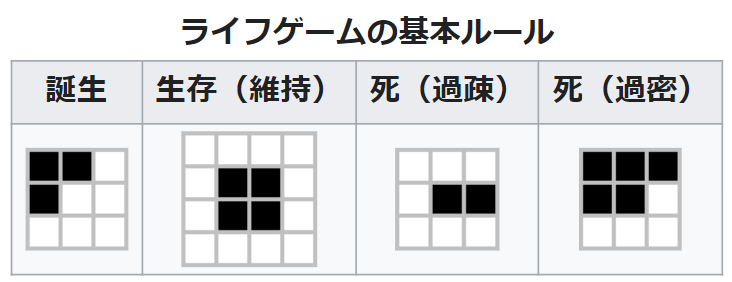

# ライフゲームのシミュレーションの様子をマトリクスLEDに表示するデバイスを作った

### 概要
- ライフゲームのシミュレーションの様子をマトリクスLEDに表示するデバイスを作った
- ブラウザから、初期パターンの設定とシミュレーションの開始・リセットができる


### ライフゲームとは
ライフゲームは、生命の誕生・進化・淘汰のプロセスをシミュレーションする簡易な数理モデルです。ライフゲームでは、まず格子状のフィールドに生きたセルを配置しておきます。次に、以下のようなルールに従って、次の世代のセルの配置を決定します。あとは同様のルールに従い、次の世代のセルの配置を繰り返し算出し、生命の進化をシミュレートしていきます。

- 誕生
    - 死んでいるセルに隣接する生きたセルがちょうど3つあれば、次の世代が誕生する。
- 生存
    - 生きているセルに隣接する生きたセルが2つか3つならば、次の世代でも生存する。
- 過疎
    - 生きているセルに隣接する生きたセルが1つ以下ならば、過疎により死滅する。
- 過密
    - 生きているセルに隣接する生きたセルが4つ以上ならば、過密により死滅する。

    
    <figcaption><a href="https://ja.wikipedia.org/wiki/ライフゲーム#ライフゲームのルール">Wikipedia</a>より引用</figcaption>

### スライド
これも[TD4の記事](/posts/td4-fpga)と同じで、学校の実験の一環として製作しました。~~記事を書くのが面倒になってきたので、~~ そのときのスライドを載せときます。

<iframe class="speakerdeck-iframe" frameborder="0" src="https://speakerdeck.com/player/79fa9cbabe8f4bffa6dbf19fdce4a9fe" title="ライフゲームの製作" allowfullscreen="true" style="border: 0px; background: padding-box padding-box rgba(0, 0, 0, 0.1); margin: 0px; padding: 0px; border-radius: 6px; box-shadow: rgba(0, 0, 0, 0.2) 0px 5px 40px; width: 100%; height: auto; aspect-ratio: 560 / 315;" data-ratio="1.7777777777777777"></iframe>
