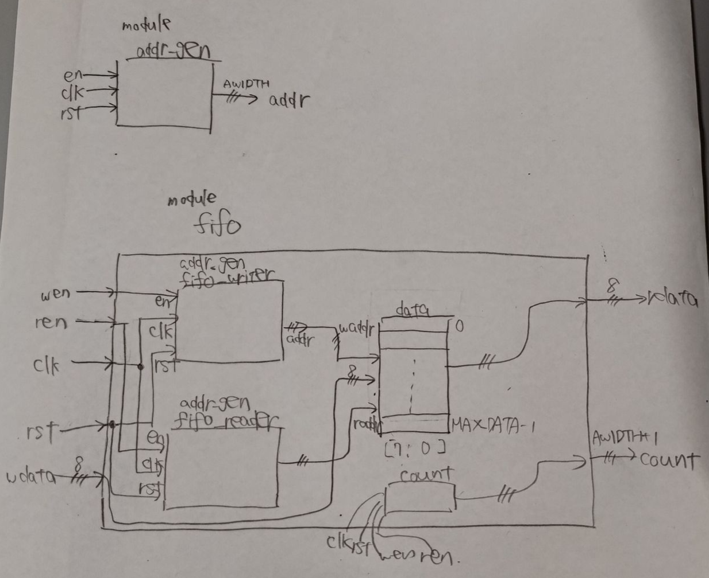

# Yosysを触ってみる


卒業研究で、OSSの論理合成ツールであるYosysを少し触ったので、そのときに書いたメモを放流

(基本的に他の人が読むことを想定して書いてないので、内容はかなり適当)

## Yosysのドキュメントを読んでみる
チュートリアルなどドキュメントは、この辺にまとまってるっぽい


## 合成を試す (Synthesis starter)
[Synthesis starter - YosysHQ Yosys 0.41-dev documentation](https://yosyshq.readthedocs.io/projects/yosys/en/latest/getting_started/example_synth.html)

> このページでは、パッケージ化された iCE40 FPGA 合成スクリプト synth_ice40 のウォークスルーをガイドします。簡単なデザインを各ステップを通して、呼び出されるコマンドと、それらがデザインに与える影響について見ていきます。synth_ice40 は iCE40 プラットフォーム固有のものですが、これから説明する操作のほとんどは、FPGA 合成スクリプトの大部分で共通です。したがって、本書は、実際に使用されるアーキテクチャに関係なく、Yosysにおける合成がどのように実行されるかについて、基礎的な理解を深めるのに役立ちます。
> 

### サンプルの回路 (Demo design)
- こういうVerilogのコードで試すらしい
    ```verilog
    // address generator/counter
    module addr_gen 
    #(  parameter MAX_DATA=256,
    	localparam AWIDTH = $clog2(MAX_DATA)
    ) ( input en, clk, rst,
    	output reg [AWIDTH-1:0] addr
    );
    	initial addr <= 0;
    
    	// async reset
    	// increment address when enabled
    	always @(posedge clk or posedge rst)
    		if (rst)
    			addr <= 0;
    		else if (en) begin
    			if (addr == MAX_DATA-1)
    				addr <= 0;
    			else
    				addr <= addr + 1;
    		end
    endmodule //addr_gen
    
    // Define our top level fifo entity
    module fifo 
    #(  parameter MAX_DATA=256,
    	localparam AWIDTH = $clog2(MAX_DATA)
    ) ( input wen, ren, clk, rst,
    	input [7:0] wdata,
    	output reg [7:0] rdata,
    	output reg [AWIDTH:0] count
    );
    	// fifo storage
    	// sync read before write
    	wire [AWIDTH-1:0] waddr, raddr;
    	reg [7:0] data [MAX_DATA-1:0];
    	always @(posedge clk) begin
    		if (wen)
    			data[waddr] <= wdata;
    		rdata <= data[raddr];
    	end // storage
    
    	// addr_gen for both write and read addresses
    	addr_gen #(.MAX_DATA(MAX_DATA))
    	fifo_writer (
    		.en     (wen),
    		.clk    (clk),
    		.rst    (rst),
    		.addr   (waddr)
    	);
    
    	addr_gen #(.MAX_DATA(MAX_DATA))
    	fifo_reader (
    		.en     (ren),
    		.clk    (clk),
    		.rst    (rst),
    		.addr   (raddr)
    	);
    
    	// status signals
    	initial count <= 0;
    
    	always @(posedge clk or posedge rst) begin
    		if (rst)
    			count <= 0;
    		else if (wen && !ren)
    			count <= count + 1;
    		else if (ren && !wen)
    			count <= count - 1;
    	end
    
    endmodule
    ```

FIFO(キュー)を表現するモジュールで、雑に図にするとこんな感じか?



### 回路を読み込ませる (Loading the design)

YosysをインストールしてPATHが通った状態で、以下のコマンドを打つ

```bash
$ yosys fifo.v

-- Parsing `fifo.v' using frontend ` -vlog2k' --

1. Executing Verilog-2005 frontend: fifo.v
Parsing Verilog input from `fifo.v' to AST representation.
Storing AST representation for module `$abstract\addr_gen'.
Storing AST representation for module `$abstract\fifo'.
Successfully finished Verilog frontend.
```

- VerilogのコードがASTの表現に変換される
    - Verilog FrontendがVerilogのコードをASTに変換する
    - 詳細は以下を参照
        - [The Verilog and AST frontends - YosysHQ Yosys 0.41-dev documentation](https://yosyshq.readthedocs.io/projects/yosys/en/latest/yosys_internals/flow/verilog_frontend.html)
    

### 合成する (Elaboration)

`synth_ice40 -top fifo` というコマンドを打つと、内部で最適化とかFPGA(ここではiCE40)に対するテクノロジマッピングの処理とかを行うスクリプトが実行される。

- スクリプトの中で、実際どういうコマンドが走るかは以下を見ると確認できる
    - [synth_ice40 - synthesis for iCE40 FPGAs - YosysHQ Yosys 0.41-dev documentation](https://yosyshq.readthedocs.io/projects/yosys/en/latest/cmd/synth_ice40.html#cmd-synth_ice40)
    
- スクリプトの最初の `begin` sectionで実行されるコマンド
    ```
    read_verilog -D ICE40_HX -lib -specify+/ice40/cells_sim.v
    hierarchy -check -top <top>
    proc
    ```
    

> `read_verilog -D ICE40_HX -lib -specify +/ice40/cells_sim.v` は iCE40 セル・モデルをロードし、プラットフォーム固有の IP ブロックをデザインに含めることができます。PLL はこの一般的な例で、後でマッピング・パスに頼るのではなく、SB_PLL40_CORE を直接参照する必要があるかもしれません。今回のシンプルなデザインではこれらのIPブロックを使用しないため、このコマンドは省略できます。ハードウェアへのマッピングを開始すると、これらのセル・モデルも必要になるため、後でロードする必要があります。
> 
- 後ろにいろいろ書いてあるのは、iCE40で使えるIPブロックを読み込ませるためのオプションのよう
    - 今回はIPを特に使わないので、別になくてもいいっぽい(?)
    - `+/` は、Yosys共有ディレクトリへの動的参照です。デフォルトでは `/usr/local/share/yosys` です。ソースディレクトリからローカルにビルドされたバージョンのYosysを使用する場合、これは同じディレクトリ内の共有フォルダになります。

今回は、`synth_ice40` の中で走ってるコマンドを一つずつ手で打って実行することで、何が起きているのかを把握する（そして、このFPGA向けの論理合成に留まらない一般的なYosysの合成のフローを理解する）。

### `addr_gen` モジュール (The addr_gen module)

```verilog
// address generator/counter
module addr_gen 
#(  parameter MAX_DATA=256,
	localparam AWIDTH = $clog2(MAX_DATA)
) ( input en, clk, rst,
	output reg [AWIDTH-1:0] addr
);
	initial addr <= 0;

	// async reset
	// increment address when enabled
	always @(posedge clk or posedge rst)
		if (rst)
			addr <= 0;
		else if (en) begin
			if (addr == MAX_DATA-1)
				addr <= 0;
			else
				addr <= addr + 1;
		end
endmodule //addr_gen
```

`hierarchy -top addr_gen` というコマンドを打つと、`addr_gen` をトップレベルのモジュールとして宣言できる。そのため、`module fifo` とかは無視される。

- `hierachy` コマンドは、回路を読み込ませた後、一番最初に実行する必要がある
    - 後に続くコマンドが、どのモジュールをトップレベルとして処理するかを知る必要があるため

```
yosys> hierarchy -top addr_gen

2. Executing HIERARCHY pass (managing design hierarchy).

3. Executing AST frontend in derive mode using pre-parsed AST for module `\addr_gen'.
Generating RTLIL representation for module `\addr_gen'.

3.1. Analyzing design hierarchy..
Top module:  \addr_gen

3.2. Analyzing design hierarchy..
Top module:  \addr_gen
Removing unused module `$abstract\fifo'.
Removing unused module `$abstract\addr_gen'.
Removed 2 unused modules.
```

`addr_gen` モジュールをYosysに読み込ませて、ブロック図として表示するとこうなる


- 上記のVerilogの `always @` に含まれている `addr <= addr + 1` や `addr == MAX_DATA - 1` といった単純なロジックは、それぞれ `$eq` とか `$add` というブロックとして表現されている
- `if .. else` のような条件分岐や、モジュール内部のメモリ要素などは `PROC` (process)というブロックによって表現されている
    - `PROC` ブロックの2行目は、このブロックが元のVerilogのソースコードのどの位置に対応しているかを表す
        - 例えば、上図の `PROC $1` の場合、`fifo.v:12.2-20:6` なので、以下の部分に対応する
        ```verilog
        always @(posedge clk or posedge rst)
        		if (rst)
        			addr <= 0;
        		else if (en) begin
        			if (addr == MAX_DATA-1)
        				addr <= 0;
        			else
        				addr <= addr + 1;
        		end
        ```
        
- 左上の `PROC $4` は初期プロセスというらしい
    - 処理のエントリーポイントを表すみたいな理解でいいのかな
- [`proc` コマンド](https://yosyshq.readthedocs.io/projects/yosys/en/latest/cmd/proc.html)を打つと、`PROC` ブロックをネットリストに変換することができる
    - このコマンドは、複数のコマンドからなるマクロである (先述の `synth_ice40` とかと同じ)
    - 動作レベルの記述をマルチプレクサやレジスタなどに変換するサブコマンドが実行される
        - ターミナルに色々表示されてるはず
        - 実際どのような処理が行われるかは以下を参照
            - [Converting process blocks - YosysHQ Yosys 0.41-dev documentation](https://yosyshq.readthedocs.io/projects/yosys/en/latest/using_yosys/synthesis/proc.html)
        
- 回路が最適化されるのを防ぐため、`proc -noopt` として実行する


`addr_gen` モジュールに対して、`proc -noopt` を実行した結果をブロック図として表示したもの

この図を見ると、`PROC` がもう少し具体的なブロックとして表現されていることが確認できる

- 例えば `if` 文は、マルチプレクサのブロック `$mux` として表現されている
- レジスタは、`$adff` (Asynchronous D-Flip-Flop)ブロックによって表現されている
- 左上に `addr[7:0]` を `8’00000000` で初期化するブロックがあるが、これは他のブロックから独立して存在しており、回路として合成できない
- そこで、実際に回路として合成する前に `clean` コマンドを実行して、このようなfloating wireを削除する必要がある
- `opt_expr` コマンドを実行する
    - 定数の入力を持つ内部のブロックに対して、定数の畳み込みを行ったり、簡単な式(expr)の書き換えを行ったりするらしい
        - [opt_expr - perform const folding and simple expression rewriting - YosysHQ Yosys 0.41-dev documentation](https://yosyshq.readthedocs.io/projects/yosys/en/latest/cmd/opt_expr.html#cmd-opt_expr)
        
    - 通常、`opt_expr` は `proc` の最後で呼び出す
- なお、複数のコマンドを打つときは、`opt_expr; clean` のようにセミコロンとスペースで区切ることで、まとめて呼び出すことができる


`opt_expr; clean` の実行後に、`addr_gen` モジュールをブロック図として表示したもの

1つ上の図と比較すると、`$2 $eq` の定数入力が `255` から `8’00000000` になっていることが確認できる。これは、`opt_expr` を実行したことで、定数入力が32bitから8bitに縮小されたことによる。

- 最適化パス(Optimization pass)でどのような処理が行われているかは、以下を参照
    - [Optimization passes - YosysHQ Yosys 0.41-dev documentation](https://yosyshq.readthedocs.io/projects/yosys/en/latest/using_yosys/synthesis/opt.html)

- あるコマンドの実行後に `opt_expr; clean` のように明示的に `clean` コマンドを呼び出す代わりに、`opt_expr;;` のようにコマンドの後ろにセミコロンを2つ重ねて書くことで、暗黙的に `clean` コマンドが実行される
- `clean` コマンドを実行することで、他のブロックに接続されずに残っている不必要なブロックを削除することができるため、後に続くコマンドでの処理を削減できる場合がある。

### `fifo` モジュール全体 (The full example)

- `hierarchy -check -top fifo` を打つ
    - トップモジュールを `module fifo` に設定
    - `-check` オプションをつけると、実装が与えられていないモジュールが含まれている場合にエラーを返す（未解決シンボルみたいな感じでは扱えなくなる）
    - 現状、`addr_gen` をトップレベルモジュールに設定しているので、以下のコマンドを打つことで、回路を読み込み直す（もちろんYosysのシェル自体を再起動してもよい）
    
    ```
    yosys> design -reset
    
    yosys> read_verilog fifo.v
    
    11. Executing Verilog-2005 frontend: fifo.v
    Parsing Verilog input from `fifo.v' to AST representation.
    Generating RTLIL representation for module `\addr_gen'.
    Generating RTLIL representation for module `\fifo'.
    Successfully finished Verilog frontend.
    
    yosys> hierarchy -check -top fifo
    
    12. Executing HIERARCHY pass (managing design hierarchy).
    
    12.1. Analyzing design hierarchy..
    Top module:  \fifo
    Used module:     \addr_gen
    Parameter \MAX_DATA = 256
    
    12.2. Executing AST frontend in derive mode using pre-parsed AST for module `\addr_gen'.
    Parameter \MAX_DATA = 256
    Generating RTLIL representation for module `$paramod\addr_gen\MAX_DATA=s32'00000000000000000000000100000000'.
    Parameter \MAX_DATA = 256
    Found cached RTLIL representation for module `$paramod\addr_gen\MAX_DATA=s32'00000000000000000000000100000000'.
    
    12.3. Analyzing design hierarchy..
    Top module:  \fifo
    Used module:     $paramod\addr_gen\MAX_DATA=s32'00000000000000000000000100000000
    
    12.4. Analyzing design hierarchy..
    Top module:  \fifo
    Used module:     $paramod\addr_gen\MAX_DATA=s32'00000000000000000000000100000000
    Removing unused module `\addr_gen'.
    Removed 1 unused modules.
    ```
    
- `addr_gen` を読み込んだときと異なり、`$abstract` モジュールが表示されていない
    - これは、`read_verilog -defer fifo.v` のように `-defer` オプションを渡したから
    - `-defer` オプション
    
    > `read_verilog` にASTだけを読み込んで、実際のコンパイルを後の `hierarchy` コマンドに延期するように指示します。これは、モジュールのデフォルトパラメータが合成不可能な無効なコードを生成する場合に便利です。これが、Yosysがコンパイルを自動的に延期する理由であり、デザインをロードした後、常に `hierarchy` コマンドを最初に実行すべき理由の1つです。このような問題が発生しないことがわかっている場合は、`-defer` を省略できます。
    > 
    - hierarchyコマンドが何をしているか、後でこれを読む
        - [hierarchy - check, expand and clean up design hierarchy - YosysHQ Yosys 0.41-dev documentation](https://yosyshq.readthedocs.io/projects/yosys/en/latest/cmd/hierarchy.html#cmd-hierarchy)
    
- 先ほどと同様に`proc` コマンドを実行して、begin sectionを終わらせる
- 回路規模が大きいので、rdataの出力のデータパスだけ図示すると以下のようになる
    - 回路全体を図示したい場合、`show fifo` のように打てばOK
    
    
- ハイライトされた `fifo_reader` ブロックは、`addr_gen` のインスタンスを表している
    - `proc -noopt` を実行した後の状態になっている
    - 型は `$paramod\\addr_gen\\MAX_DATA=s32'00000000000000000000000000000000`
        - `$paramod` はパラメトリックモジュールを表し、`MAX_DATA` パラメータが指定された値に設定された `addr_gen` モジュールのインスタンスを表す
- もう一方のハイライトされてる `$memrd` ブロックは、Verilogの `data` という変数に対応してそう?
    - どのようなタイプのメモリとして実装されるかは、合成のこの段階では分からない
    - ここで `$memrd` は非同期で、clockとenableが未定義になっている（`1’x` になっている）

> もう1つのハイライトされたブロックは `$memrd` セルである。合成のこの段階では、どのようなタイプのメモリが実装されるかはまだわからないが、`rdata <= data[raddr];` がメモリからの読み出しとして実装される可能性があることはわかっている。ここでの `$memrd` セルは非同期であり、クロックとイネーブル信号の両方が未定義であることに注意してください。
> 

### 平坦化 (Flattening)

平坦化(Flattening)を行うことで、あるモジュールがサブモジュールを内包するという階層構造が解消される。このことによって、モジュール間にまたがる最適化を行えるようになる。

- モジュールが具体的な実装に置換されるっぽい
    - [flatten - flatten design - YosysHQ Yosys 0.41-dev documentation](https://yosyshq.readthedocs.io/projects/yosys/en/latest/cmd/flatten.html#cmd-flatten)
    

```
yosys> flatten

15. Executing FLATTEN pass (flatten design).
Deleting now unused module $paramod\addr_gen\MAX_DATA=s32'00000000000000000000000100000000.

yosys> clean
Removed 3 unused cells and 25 unused wires.

```


`flatten;;` (上記の2コマンドを打ったのと等価)を実行後に、 `rdata` の出力のデータパスを図示した様子

ブロックの位置関係は多少変わっているが、

- 1つ上の図の `fifo_reader` というインスタンスが、`proc -noopt` を実行した後の `addr_gen` モジュールの具体的な実装に置き換えられている
- `addr` という出力が、`fifo_reader.addr` という名前に変わり、1つ上の図の、`$memrd` の `$raddr` という入力（ワイヤー）に置き換えられている

ことが確認できる。

なお、ワイヤーのマージは `clean` コマンドのpassの中で行われる。

- `flatten;;` した後の出力を見ると確認できる

また、場合によっては、この段階で `tribuf` や `deminout` といったコマンドを実行し、合成対象のアーキテクチャに適した論理ブロックへの変換を行う。

- `tribuf` は、`0, 1, Z (ハイインピーダンス)` の3値を入力にもつ `$mux` をトライステートバッファに変換するらしい（あんまりよく理解できてない）

`$mux` multiplexer

`$mul` multiplier


## テクノロジマッピング
Yosysのテクノロジマッピング : FPGA向きのテクノロジマッピングがメインっぽい?

abcをyosysの中で呼ぶこともできる
遅延とかのパラメータを考慮してテクノロジマッピングしたい場合は、こちらを使った方が良さそう?

> `abc [options] [selection]`
> 
> 
> This pass uses the ABC tool [1] for technology mapping of yosys's internal gate
> library to a target architecture.
> 

## その他

- 等価性判定
    - Yosysにも等価性判定する機能あるっぽい?
    - 最適化とか平坦化といった処理はやらない方がいい?

- Yosysで出力したJSONからネットリストのSVGを出力してくれるツール


- `aigmap` コマンド
    - and-inverter-graphにマッピングする
https://yosyshq.readthedocs.io/projects/yosys/en/latest/cmd/aigmap.html

- `splitnets` コマンド
    - 複数bit幅をもつwireを複数本の1bitのwireに変換する
https://yosyshq.readthedocs.io/projects/yosys/en/latest/cmd/splitnets.html

- `clean` コマンド
    - (実質的に未使用の)冗長なcellやwireを削除
https://yosyshq.readthedocs.io/projects/yosys/en/latest/cmd/clean.html
